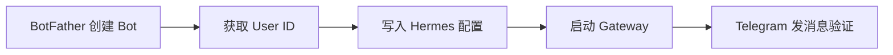

# 03 · 配置绑定 Telegram

面向 **Mac 个人助理场景**：把 Hermes Agent 接到 Telegram，在手机上发消息，本机 Mac 上的 Agent 就能执行并回复。

> 前置条件：已完成 [02-Mac安装配置与日常维护.md](./02-Mac安装配置与日常维护.md) 中的安装与 `hermes setup`（CLI 能正常对话）。

---

## 一、整体流程（5 步）



| 步骤 | 做什么 | 产出 |
|------|--------|------|
| 1 | 在 Telegram 找 @BotFather 创建机器人 | **Bot Token** |
| 2 | 找 @userinfobot 查自己的数字 ID | **User ID** |
| 3 | `hermes gateway setup` 或手动写 `.env` | 配置写入 `~/.hermes/` |
| 4 | `hermes gateway start` | Gateway 后台运行 |
| 5 | 在 Telegram 给 Bot 发消息 | 收到 Agent 回复 |

---

## 二、Step 1：创建 Telegram Bot

1. 打开 Telegram，搜索 **@BotFather**（或访问 [t.me/BotFather](https://t.me/BotFather)）。
2. 发送 `/newbot`。
3. 按提示设置：
   - **Display name**（显示名）：如 `Hermes Agent`（任意）
   - **Username**（用户名）：必须唯一且以 `bot` 结尾，如 `my_hermes_bot`
4. BotFather 会返回 **API Token**，格式类似：

```
123456789:ABCdefGHIjklMNOpqrSTUvwxYZ
```

> **安全提示**：Token 等同于 Bot 的密码，不要提交到 Git 或发给他人。若泄露，在 BotFather 里用 `/revoke` 立即撤销并重新生成。

### 可选：美化 Bot（推荐）

在 @BotFather 里可进一步设置：

| 命令 | 作用 |
|------|------|
| `/setdescription` | 用户点「开始」前看到的说明 |
| `/setabouttext` | Bot 资料页简介 |
| `/setuserpic` | 头像 |
| `/setcommands` | 聊天框 `/` 菜单里的命令 |

建议的 `/setcommands` 内容：

```
help - 显示帮助
new - 开始新对话
sethome - 将当前聊天设为主频道
```

---

## 三、Step 2：获取你的 Telegram User ID

Hermes 用**数字 User ID** 做访问控制（不是 `@username`）。

**推荐方式**：在 Telegram 里给 **@userinfobot** 发任意消息，它会立刻回复你的数字 ID，例如 `123456789`。

备用：[@get_id_bot](https://t.me/get_id_bot)

记下这个数字，下一步配置要用。

---

## 四、Step 3：写入 Hermes 配置

### 方式 A：交互式向导（推荐）

```bash
hermes gateway setup
```

1. 用方向键选择 **Telegram**。
2. 粘贴 Bot Token。
3. 输入你的 User ID（多个用户用英文逗号分隔）。
4. 向导会把配置写入 `~/.hermes/.env`。

### 方式 B：手动配置

编辑 `~/.hermes/.env`，添加：

```bash
# Telegram Bot Token（来自 BotFather）
TELEGRAM_BOT_TOKEN=123456789:ABCdefGHIjklMNOpqrSTUvwxYZ

# 允许使用的用户 ID（逗号分隔多个）
TELEGRAM_ALLOWED_USERS=123456789
```

> **默认拒绝所有人**：未出现在 `TELEGRAM_ALLOWED_USERS` 里的用户，Bot 不会响应。这是安全设计，务必填对自己的 ID。

### 核心配置文件位置

| 路径 | 用途 |
|------|------|
| `~/.hermes/.env` | Bot Token、User ID 等密钥 |
| `~/.hermes/config.yaml` | 模型、工具、Gateway 高级选项 |
| `~/.hermes/logs/gateway.log` | Gateway 运行日志（排错必看） |

---

## 五、Step 4：启动 Gateway

### 前台测试（首次建议）

```bash
hermes gateway
```

终端保持打开，Bot 应在几秒内上线。此时可在 Telegram 发消息验证。

### Mac 后台常驻（推荐）

```bash
hermes gateway install    # 注册 launchd 用户服务
hermes gateway start      # 启动
hermes gateway status     # 查看状态
```

常用管理命令：

```bash
hermes gateway stop
hermes gateway restart
tail -f ~/.hermes/logs/gateway.log   # 实时看日志，Ctrl+C 退出
```

---

## 六、Step 5：验证绑定成功

1. 在 Telegram 搜索你创建的 Bot（如 `@my_hermes_bot`）。
2. 点击 **Start** 或直接发一条消息，例如：`你好，介绍一下你自己`。
3. 若几秒内收到回复，说明绑定成功。

若没反应，跳到本文 **[九、常见问题](#九常见问题)** 排查。

---

## 七、进阶配置（按需）

### 1. 主频道（Home Channel）

定时任务（cron）的结果会发到「主频道」。在任意 Telegram 聊天（私聊或群组）里发送：

```
/sethome
```

也可手动写入 `~/.hermes/.env`：

```bash
TELEGRAM_HOME_CHANNEL=-1001234567890
TELEGRAM_HOME_CHANNEL_NAME="My Notes"
```

> 群组 Chat ID 是负数（如 `-1001234567890`）；私聊 ID 与你的 User ID 相同。

### 2. 多人 / 团队使用

在 `~/.hermes/.env` 里用逗号分隔多个 User ID：

```bash
TELEGRAM_ALLOWED_USERS=123456789,987654321,555555555
```

### 3. 群组使用（重要）

Telegram Bot 默认开启 **Privacy Mode（隐私模式）**，在群里只能看到：
- 以 `/` 开头的命令
- 直接回复 Bot 的消息
- @Bot 的消息

**要在群里正常对话，二选一：**

- 在 @BotFather → `/mybots` → 选你的 Bot → **Bot Settings → Group Privacy → Turn off**，然后**把 Bot 移出群再重新拉入**（Telegram 会缓存旧设置）。
- 或将 Bot **设为群管理员**（管理员 Bot 不受隐私模式限制）。

**推荐群组配置**（仅 @ 提及或回复时才响应，避免刷屏）：

在 `~/.hermes/config.yaml` 中添加：

```yaml
telegram:
  require_mention: true
```

### 4. 代理（国内网络）

若直连 Telegram API 不稳定，可在 `~/.hermes/.env` 设置：

```bash
TELEGRAM_PROXY=socks5://127.0.0.1:1080
```

或在 `~/.hermes/config.yaml`：

```yaml
telegram:
  proxy_url: "socks5://127.0.0.1:1080"
```

支持 `http://`、`https://`、`socks5://`。

### 5. 语音消息

- **收到的语音**：Hermes 会自动转文字（需配置 STT，本地可用 `faster-whisper`）。
- **发出的语音回复**：Edge TTS 需安装 ffmpeg：

```bash
brew install ffmpeg
```

---

## 八、常用 Telegram 命令

在 Bot 聊天里可直接使用（具体以当前 Hermes 版本为准）：

| 命令 | 作用 |
|------|------|
| `/help` | 显示帮助 |
| `/new` | 开始新对话（重置当前会话） |
| `/sethome` | 将当前聊天设为主频道 |
| `/model` | 切换模型（可弹出交互式选择器） |
| `/status` | 查看当前状态 |
| `/topic` | 开启多会话 DM 模式（需 BotFather 开启 Threads） |

---

## 九、常见问题

| 现象 | 可能原因 | 处理建议 |
|------|----------|----------|
| Bot 完全无响应 | Token 错误或 Gateway 未启动 | 核对 `TELEGRAM_BOT_TOKEN`；`hermes gateway status` → `restart` |
| 提示 unauthorized | User ID 不在白名单 | 用 @userinfobot 核对 ID，更新 `TELEGRAM_ALLOWED_USERS` |
| 私聊正常、群里无响应 | Privacy Mode 未关闭 | BotFather 关闭 Group Privacy，**移出群再重新加入** |
| 群里只有 @ 才有回复 | `require_mention: true` | 正常行为；或改为 `false`（不推荐，易刷屏） |
| 语音无法转文字 | STT 未配置 | 安装 `faster-whisper` 或配置 `GROQ_API_KEY` |
| Token 失效 | 曾在 BotFather 撤销 | `/token` 或 `/revoke` 后重新生成，更新 `.env` |
| Gateway 启动报错 | 模型/API Key 未配 | 先确保 `hermes setup` 完成，再 `hermes doctor` |

**推荐排错顺序：**

```bash
hermes doctor
hermes gateway status
tail -50 ~/.hermes/logs/gateway.log
```

---

## 十、与 CLI 的关系

| 入口 | 场景 |
|------|------|
| 终端 `hermes` | 本地深度工作、调试配置 |
| Telegram Bot | 手机轻量指令、远程助理 |

两者共用同一套 `~/.hermes/` 配置、记忆与 Skills，可并存使用。

---

## 官方参考

- Telegram 专题文档：https://hermes-agent.nousresearch.com/docs/user-guide/messaging/telegram
- Gateway 总览：https://hermes-agent.nousresearch.com/docs/user-guide/messaging/
- 团队 Telegram 助理指南：https://github.com/NousResearch/hermes-agent/blob/main/website/docs/guides/team-telegram-assistant.md

下一步若需配置 Discord / Slack，同样运行 `hermes gateway setup` 并按向导操作即可。
